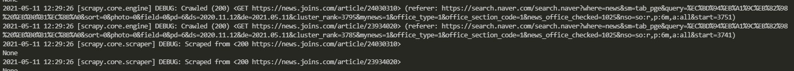

# naver news crawler

네이버 뉴스에서
코로나 + 백신 키워드로
현재기준 최근 6개월 뉴스기사를 수집하는 수집기 입니다.

수집된 기사들은 로컬 monogodb 에 저장됩니다.

- scrapy
- pandas
- lxml
- pymongo

#### 수집 기준 url 설명
- base 도메인 https://search.naver.com/search.naver
- query= 검색할 키워드
- sort=1 (최신순 정렬)
- ds= YYYY.MM.DD 형식 (기사 날짜 시작 범위)
- de= YYYY.MM.DD 형식 (기사 날짜 시작 범위)
- news_office_checked= 언론사 코드(네이버 제공)
- start= 1 (시작 페이지, 1을 기준으로 10개씩 증가)

#### mongodb 정보
- database : naver
- collection : news

```
title : 뉴스기사 타이틀
contents : 뉴스기사 본문 html
url : 뉴스기사 url
press : 언론사
datetime : 뉴스기사 작성시간
```
#### 데이터베이스 실행
```
docker-compose up -d
```

#### 수집기 실행
```
scrapy crawl navernews
```


#### 수집 실행 디버깅
